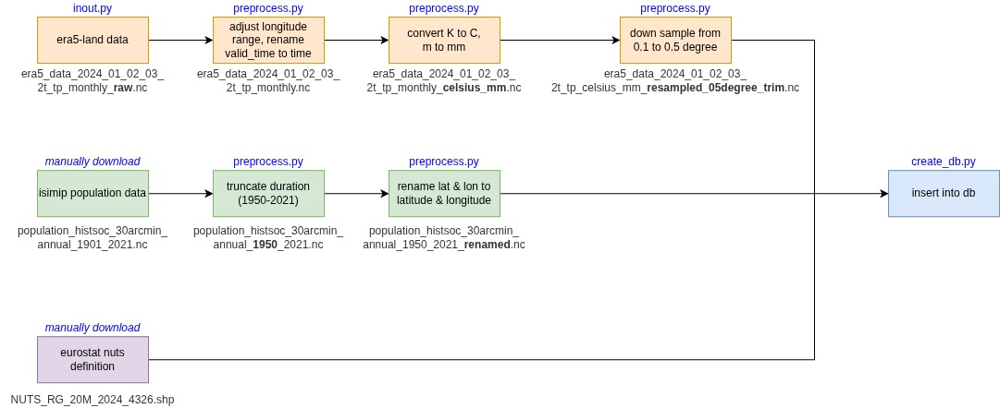
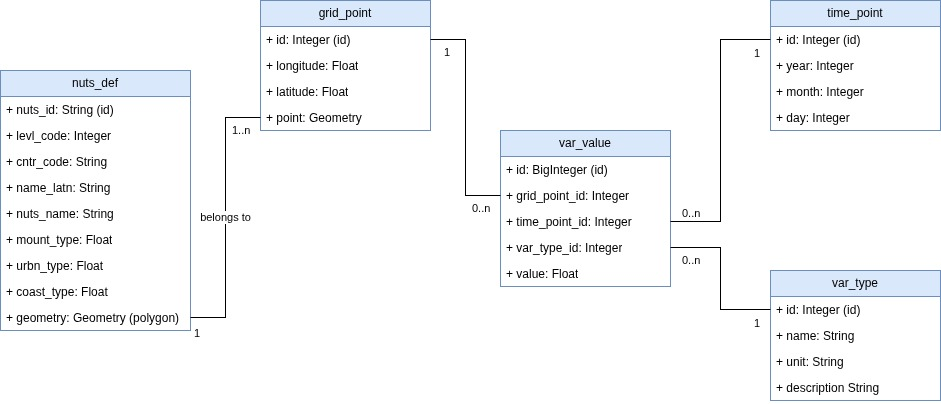

# Data Lake & Database Backend

## Data flowchart
Downloaded data files will go through preprocessing steps as follows:



## Data model
Downloaded and (pre)processed data is stored in the database as follows:


## Run PostgreSQL database with Docker
The PostgreSQL database is employed using Docker, use the following command to enable docker service:
```bash
docker compose up -d
```
Option `-d` is used to run the docker service in background.
